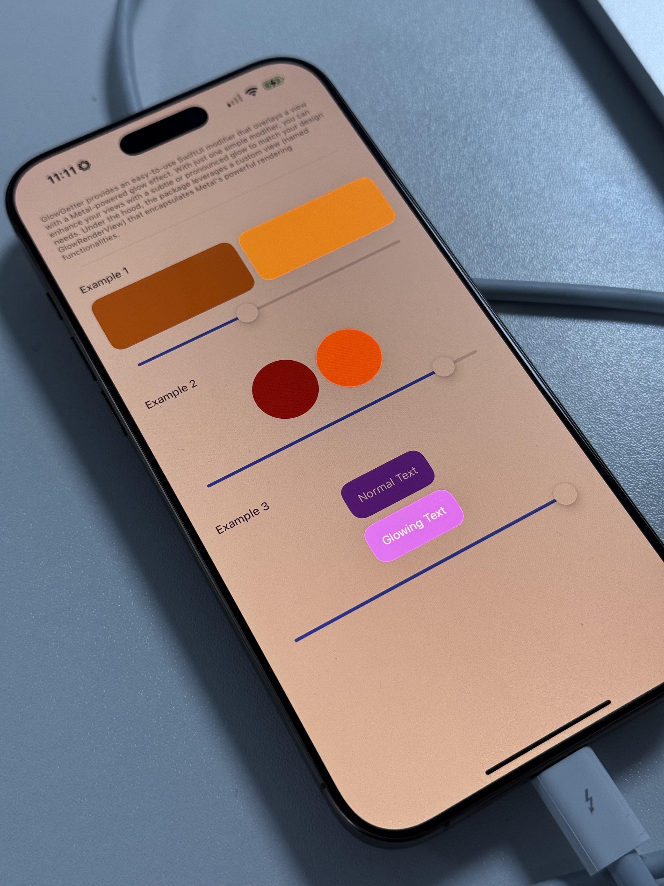
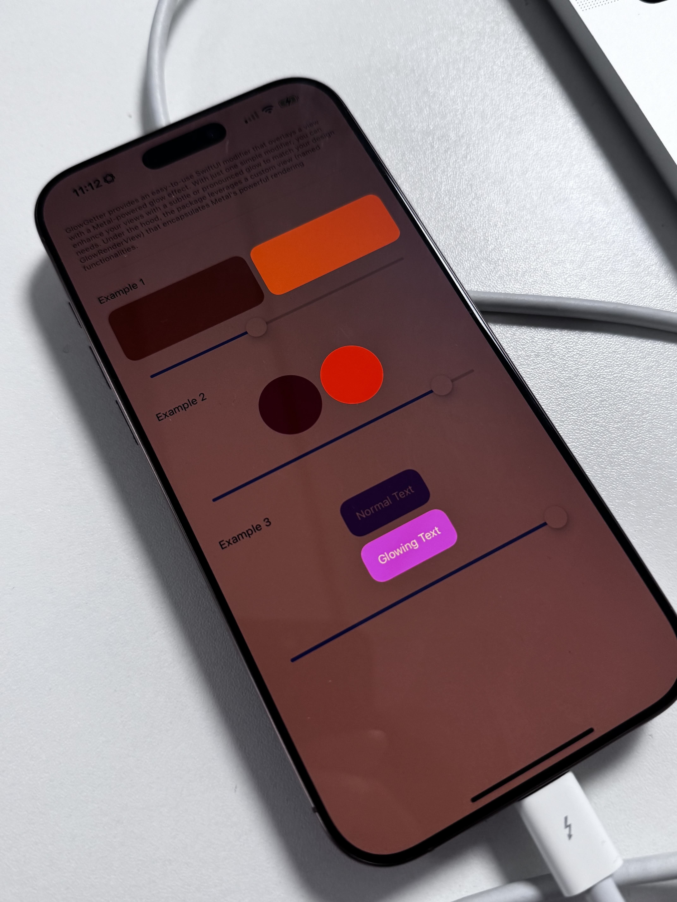

<div align="center">
  
  <h1><b>GlowGetter</b></h1>
  <p>
    A lightweight Swift package that makes it a breeze to add a
    customizable glow effect to your SwiftUI views.
    <br>
    <i>Compatible with iOS 15.0 and later</i>
  </p>
</div>

<div align="center">
  <a href="https://swift.org">
    
  </a>
  <a href="https://www.apple.com/ios/">
    
  </a>
  <a href="LICENSE">
    
  </a>
</div>


---

## **Overview**

GlowGetter provides an easy-to-use SwiftUI modifier that overlays a view with a Metal-powered glow effect. With just one simple modifier, you can enhance your views with a subtle or pronounced glow to match your design needs. Under the hood, the package leverages a custom view (named `GlowRenderView`) that encapsulates Metal's powerful rendering functionalities.

### **Examples**

Here are some examples of GlowGetter in action:

<div align="center">
<table>
  <tr>
    <td align="center">
      
    </td>
    <td align="center">
      
    </td>
  </tr>
</table>
</div>

**Please Note:**  
The current implementation of GlowGetter is experimental. We acknowledge that the rendering method isn’t perfect yet, and improvements are planned for possible future releases.

---

## **Installation**

### Swift Package Manager

1. In Xcode, navigate to **File > Add Packages...**
2. Enter the repository URL:  
   `https://github.com/Aeastr/GlowGetter`
3. Follow the prompts to add the package to your project.

---

## **Key Components**

- **GlowRenderView**  
  This view is responsible for setting up a Metal-rendered glow overlay. It is embedded within a SwiftUI wrapper to make the effect easily composable.

- **SwiftUI Modifier (`.glow(_:_:)`)**  
  A single modifier overlays your view with a glow effect. The intensity of the glow can be adjusted with the first parameter, and you can optionally provide a shape to clip the glow.

---

## **Basic Usage**

Simply import the package and apply the modifier to any SwiftUI view.

### **Default Glow**

If you just want to apply a glow with a specified intensity, use the modifier with only the intensity parameter:

```swift
import SwiftUI
import GlowGetter

struct ContentView: View {
    var body: some View {
        Color.orange
            .glow(0.8)
    }
}
```

### **Glow with Clipping**

You can also control the shape of the glow by using the optional clipping parameter. For instance, to clip the glow to a circular shape, pass a `Circle()` as the second argument:

```swift
import SwiftUI
import GlowGetter

struct CircularGlowContentView: View {
    var body: some View {
        Color.orange
            .clipShape(Circle())
            .glow(0.8, Circle())
    }
}
```

Or if your design calls for a rounded rectangle, simply provide a `.rect`:

```swift
import SwiftUI
import GlowGetter

struct RoundedGlowContentView: View {
    var body: some View {
        Color.orange
            .clipShape(.rect(cornerRadius: 20))
            .glow(0.8, .rect(cornerRadius: 20))
    }
}
```

---

## **How It Works**

GlowGetter uses a Metal layer behind the scenes to produce a glow effect by blending a rendered overlay with the underlying view content. The overlay is applied using a custom SwiftUI view (`GlowRenderView`), which is wrapped up inside a neat `.glow(_:)` modifier. This allows you to add or remove the effect in a declarative manner.

> This implementation serves as a quick way to achieve a glow effect using a SwiftUI overlay. It may not be the most ideal method for high-performance or production-quality rendering. For optimal results in demanding scenarios, a more robust Metal-based rendering pipeline is recommended.


---

## **Acknowledgments**

Special thanks to [Jordi Bruin](https://github.com/jordibruin) | [X](https://x.com/jordibruin) and [Ben Harraway](https://github.com/BenLumenDigital) | [X](https://x.com/BenLumenDigital) for their invaluable insights and assistance in refining the underlying rendering functionality.

This repo adapts some code that was built for [Vivid](http://getvivid.app), which lets you use your MacBook at the maximum brightness.

---

## **License**

GlowGetter is available under the MIT license. See the [LICENSE](LICENSE) file for more information.
